# PDF Library → HTML-First Migration: Agent Design & Execution Guide


**Version:** 2.0  

**Date:** June 2026  

**Scope:** Agentic pipeline for replacing TallPDF.NET (or any programmatic .NET PDF library)

with ASP.NET Core Razor views rendered to PDF via Playwright headless Chromium.


> **v2.0 changes:** Automated reference baseline capture and pixel validation removed — the

> developer performs manual visual sign-off against real data once the application runs on .NET 10.

> Pipeline is a single track: Discovery → Scope → Infrastructure → Per-Report Conversion +

> Static Review → Stub Preview Finalisation → Wrap-Up. Manifest path is `test/pdf-migration/manifest.json`.

>

> **v2.1 changes:** Stub preview system promoted to a first-class generic pipeline feature.

> `pdf-infrastructure` now scaffolds the empty stub preview shells; `pdf-report-converter` adds

> one factory method and one preview route per report; `pdf-migration-orchestrator` adds a Step 4b

> finalisation pass after all reports are converted; `pdf-validation` verifies stub artefacts as part

> of static review.


---


## 1. Purpose and Context


### Why This Migration Is Needed


The current target system generates 14 distinct PDF report types using

TallPDF.NET v3.0.23, a Windows-only commercial library. This library is a hard blocker

for the planned migration to Linux-based AWS ECS Fargate containers because:


- It is a native Windows GDI+ library with no Linux support

- Two Ranking reports additionally depend on `System.Web.DataVisualization`, another

  Windows-only charting library

- The library version is unsupported, with no confirmed .NET 10 compatibility

- Licence keys are committed to source control in plain text


The replacement approach — **HTML-first rendering via Razor + Playwright** — is

cross-platform, open-source, and aligns naturally with the existing data model

(profile field values are already stored as HTML markup).


### Why an Agentic Approach


The migration involves 14 report types across two projects, each with different complexity, data structures,

and entry points. Manual migration of this scope carries high regression risk.

The agentic pipeline enforces:


- A consistent discovery-first approach so nothing is missed

- Incremental conversion (one report at a time) with static code review blocking

  the queue before the next report starts

- Hard gates that prevent proceeding past a failing stage

- Human confirmation only at the one decision that genuinely requires judgement:

  scope confirmation (Step 2)

- Manual visual sign-off against real data once the application runs on .NET 10 —

  no automated pixel diff is part of the pipeline


---


## 2. Repository Structure


```

.github/

├── Agents/

│   ├── pdf-migration-orchestrator.agent.md   ← Entry point. Invoke this.

│   ├── pdf-discovery.agent.md

│   ├── pdf-infrastructure.agent.md

│   ├── pdf-report-converter.agent.md

│   └── pdf-validation.agent.md

└── Skills/

    └── pdf-html-migration/

        ├── SKILL.md                           ← Skill discovery surface

        ├── references/

        │   ├── discovery-procedure.md

        │   ├── obtaining-test-profile-ids.md  ← application-specific, not part of generic pipeline

        │   ├── playwright-pdf-pipeline.md

        │   ├── razor-layout-guide.md

        │   └── report-conversion-patterns.md

        └── assets/

            ├── PlaywrightPdfService.cs.template

            ├── _PdfLayout.cshtml.template

            └── report-inventory.json.template

```


**Runtime artefacts** (created during execution, not checked in beforehand):


```

report-inventory.json                          ← Produced by pdf-discovery

docs/ADR/adr-pdf-library-replacement.md       ← Written at end of pipeline

 

test/pdf-migration/

└── manifest.json                              ← Written and updated throughout

 

<TargetProject>/Stubs/ReportStubFactory.cs     ← Shell created by pdf-infrastructure

                                                  One method added per report by pdf-report-converter

                                                  Delete when shared libraries compile on target .NET

<TargetProject>/Controllers/PreviewReportsController.cs

                                               ← Shell created by pdf-infrastructure

                                                  One action added per report by pdf-report-converter

                                                  GET /reports/preview — index of all converted reports

                                                  GET /reports/preview/{name} — single report (HTML, not PDF)

                                                  Delete when shared libraries compile on target .NET

<TargetProject>/Stubs/SharedLibraryStubs.cs    ← Shell created by pdf-infrastructure (create-new only)

                                                  Targeted stubs for observed external types added per

                                                  report by pdf-report-converter (create-new only)

                                                  Delete when shared libraries compile on target .NET

```


All three stub files are wrapped in `#if DEBUG` — never present in release builds.

All three are temporary development aids deleted once the shared libraries compile.


All generated application code (Razor views, view models, entry points, xUnit tests)

is written to the target project and committed to the migration branch.


---


## 3. Agent Catalogue


### 3.1 `pdf-migration-orchestrator` (User-Invocable)


**File:** `.github/Agents/pdf-migration-orchestrator.agent.md`  

**Tools:** `agent`, `read`, `search`, `todo`  

**Invoked by:** The user directly


**Purpose:**  

Programme controller for the entire pipeline. Does not write application code.

Delegates all implementation to the five specialist sub-agents and enforces the

gate sequence. Manages todo tracking so progress is visible throughout a run.


**When to invoke:**  

Type `/pdf-html-migration` in GitHub Copilot Chat, or explicitly ask:

> "Start the PDF library migration. The library being replaced is TallPDF.NET."


**Pipeline steps:**


| Step | Description |

|---|---|

| Step 1 | Discovery — invoke `pdf-discovery`, produce `report-inventory.json` |

| Step 2 | Scope Confirmation — human gate, user confirms in-scope report list |

| Step 3 | Infrastructure Setup — invoke `pdf-infrastructure`, verify structural markers + stub shells |

| Step 4 | Per-Report Conversion + Static Review — converter → validator loop |

| Step 4b | Stub Preview Finalisation — verify one factory method + one preview route per report |

| Step 5 | Wrap-Up — write ADR, print manual checklist |


**Gates enforced:**


| Gate | Condition |

|---|---|

| After Step 1 | `report-inventory.json` present and complete |

| After Step 2 | User confirms in-scope list recorded as todo items |

| After Step 3 | All infrastructure structural markers verified + stub preview shells present |

| After each Step 4 cycle | `"converted-static-review-passed"` in `test/pdf-migration/manifest.json`; stub factory method and preview route present |

| After Step 4b | One `ReportStubFactory` method and one `PreviewReportsController` action verified per report |

| Step 5 | ADR written · manual checklist printed |


**Human confirmation points:** Scope confirmation (Step 2) only. All other

decisions are made automatically from documented rules.


> **Visual sign-off:** Once the application compiles on .NET 10, browse

> `GET /reports/preview` to confirm all reports render correctly against stub data.

> Then browse each report entry point with real data and compare to the originals.

> The `SmokeTest.cshtml` endpoint confirms the Playwright pipeline is operational.

> No automated pixel diff is part of this pipeline.


---


### 3.2 `pdf-discovery` (Sub-Agent)


**File:** `.github/Agents/pdf-discovery.agent.md`  

**Tools:** `read`, `search`  

**Invoked by:** `pdf-migration-orchestrator` (Step 1)


**Purpose:**  

Read-only codebase analyst. Produces a machine-readable inventory of every PDF

report class in the codebase — regardless of which PDF library is in use. This

inventory is the single source of truth consumed by all downstream agents.


**What it does:**

1. Fingerprints the PDF library from `.csproj` / `packages.config` references,

   recording assembly name, version, DLL paths, Windows-only status, and licence

   key locations

2. Discovers all report classes by inheritance chain and PDF library namespace imports

3. Maps each report class to its entry point (ASPX page / controller action / route)

4. Detects chart library dependencies within each report class

5. Analyses base classes to identify cross-cutting features needed by `_PdfLayout.cshtml`

6. Finds shared block/component classes used by multiple reports

7. Assigns a complexity tier (Low / Medium / High / Very High) using a mechanical

   scoring table

8. Records the test data scenarios required for the reference generator

9. Resolves the **target project** — scans the solution for an existing SDK-style

   ASP.NET Core web project (`use-existing`) or derives a new project name from

   the primary web project by appending `.Core` (`create-new`). Records

   `targetProject` block in the inventory including compatible project references

   and the solution folder to register the new project under


**Outputs:**  

`report-inventory.json` — complete structured inventory of all reports, base classes,

shared components, entry points, complexity scores, and the `targetProject` block

consumed by all downstream agents.


**Reference loaded:** `discovery-procedure.md`


**Guardrails:** Read-only. Every finding must cite a file path and class name.


---


### 3.3 `pdf-infrastructure` (Sub-Agent)


**File:** `.github/Agents/pdf-infrastructure.agent.md`  

**Tools:** `read`, `edit`, `search`, `execute`  

**Invoked by:** `pdf-migration-orchestrator` (Step 4)


**Purpose:**  

Builds the Playwright PDF rendering pipeline and the base Razor layout that all

14 report Razor views inherit from. Runs exactly once. No per-report conversion

begins until the smoke test confirms end-to-end PDF generation works.


**What it does (Step 0 — before creating any files):**  

Reads `targetProject` from `report-inventory.json` and branches:

- `use-existing` — verifies the existing ASP.NET Core project folder and binds `<TargetProject>` to it

- `create-new` — scaffolds a new SDK-style `.csproj` targeting `net10.0`, creates

  `Program.cs` and `appsettings.json`, adds `<ProjectReference>` entries for

  compatible shared libraries, and registers the project in the `.sln` file under

  the configured solution folder via `dotnet sln add`


**What it creates (Steps 1–6):**


| Artefact | Location | Purpose |

|---|---|---|

| New `.csproj` | `<TargetProject>/` | SDK-style `net10.0` web project (create-new only) |

| `IPlaywrightPdfService` | `<TargetProject>/Services/Pdf/PlaywrightPdfService.cs` | Service wrapping Playwright `page.PdfAsync()` |

| `PdfRenderOptions` | Same file | Options DTO: paper size, margins, wait function |

| `PdfRenderException` | Same file | Typed exception — never silently returns partial bytes |

| `PdfLayoutModel` | `<TargetProject>/ViewModels/Reports/PdfLayoutModel.cs` | Base view model: `ReportTitle`, `ProfileName`, `IsDraft`, `LogoVariant` |

| `_PdfLayout.cshtml` | `<TargetProject>/Views/Shared/_PdfLayout.cshtml` | Base Razor layout with all CSS print features |

| Smoke test page | `<TargetProject>/Pages/Reports/SmokeTest.cshtml` | Created now; executable once shared libraries target .NET 10 |

| `Dockerfile` update | Project `Dockerfile` | Installs Playwright Chromium and Linux shared library dependencies |

| DI registration | `Program.cs` | Registers `IPlaywrightPdfService` as Singleton |

| `ReportStubFactory.cs` | `<TargetProject>/Stubs/ReportStubFactory.cs` | Empty `#if DEBUG` shell; one method per report added by converter |

| `PreviewReportsController.cs` | `<TargetProject>/Controllers/PreviewReportsController.cs` | Empty `#if DEBUG` shell; one action per report added by converter |

| `SharedLibraryStubs.cs` | `<TargetProject>/Stubs/SharedLibraryStubs.cs` | Empty `#if DEBUG` shell (create-new only); targeted stubs added per report by converter |


**Key implementation decisions enforced:**

- `SemaphoreSlim` for concurrency limiting (default: 3 concurrent renders, configurable)

- Single `IBrowser` instance shared across requests; new `IBrowserContext` per render

- Magic bytes validation before returning — `PdfRenderException` thrown on any failure

- `WaitForFunctionAsync("chartRendered")` support for chart-embedded reports


**References loaded:** `playwright-pdf-pipeline.md`, `razor-layout-guide.md`  

**Assets used:** `PlaywrightPdfService.cs.template`, `_PdfLayout.cshtml.template`


**Guardrails:** Does not remove the old library at this stage. Does not create any

report-specific views. Does not attempt to build or run the new project — it

cannot compile until shared libraries target .NET 10. Halts only if static file

verification fails. `SmokeTest.cshtml` is created as a placeholder and executes

naturally once the application first compiles on .NET 10. Stub preview files are

development-time only (`#if DEBUG`); any accidental release inclusion is prevented

at the compiler level.


---


### 3.4 `pdf-report-converter` (Sub-Agent — invoked N times)


**File:** `.github/Agents/pdf-report-converter.agent.md`  

**Tools:** `read`, `edit`, `search`  

**Invoked by:** `pdf-migration-orchestrator` (Step 4, once per report)


**Purpose:**  

Converts exactly one programmatic PDF report class into a Razor view + C# view

model. Invoked N times by the orchestrator in ascending complexity order so simple

reports validate the pipeline before complex ones are tackled.


**What it does per report:**

1. Reads the full source of the report class, its base classes, and all shared

   block classes it references

2. Classifies the report into one of four archetypes:

   | Archetype | Pattern | Example reports |

   |---|---|---|

   | **A — Data-driven iterative** | `@foreach` over a collection | Full Profile, Contributions, Disease Reviews, Guidance reports |

   | **B — Hardcoded mapping** | Fixed `(section, question)` index pairs extracted to a shared constant | Summary Profile, Summary Prioritisation, QA Brief |

   | **C — Side-by-side comparison** | Two-column diff grid, per-type comparison partials | Profile Version Comparison |

   | **D — Chart-embedded** | Chart.js replacing Windows charting library; `WaitForFunctionAsync` | Profile Ranking, Ranking RFI |


3. Creates the **C# view model** inheriting from `PdfLayoutModel`:

   - Fetches data using the same data access path as the original class

   - Exposes typed named properties (never raw index pairs to the view)

   - For Archetype B: `static readonly (int, int)[]` mapping constant, shared with

     paired guidance report

   - Resolves `FirstOrDefault` results with null guards (fixes issue #4 from original codebase)

   - Adds an `internal` parameterless stub constructor populating all properties

     with representative hard-coded values (used by `ReportStubFactory` only)


4. Creates the **Razor view** applying translations from the full translation table:

   - `XhtmlParagraph` → `@Html.Raw(Model.FieldValue)`

   - Section loops → `@foreach`

   - Watermark, header, footer, page numbers → delegated to `_PdfLayout.cshtml`

   - `DirectCast` → safe C# `is` pattern match

   - Checkbox bitmaps → inline SVG

   - Logo bitmaps → `` static assets

   - Coloured cells → CSS `style="background-color: rgb(...)"`

   - Chart → `<canvas>` + Chart.js `<script>` block


5. Creates the **Razor Page or controller action** at the entry point URL from

   `report-inventory.json`: validates input, renders view, calls

   `IPlaywrightPdfService`, returns `File(bytes, "application/pdf")`


6. Creates an **xUnit test class** for the view model asserting correct data

   mapping, null safety on hardcoded mappings, and `IsDraft` logic


7. Adds a **stub factory method** to `ReportStubFactory.cs` — one static method

   returning a fully-populated view model from hard-coded data (three variants:

   realistic data, null/empty fields, `IsDraft = true`)


8. Adds a **preview route** to `PreviewReportsController.cs` — one `GET` action

   at `/reports/preview/{report-name}` calling `ReportStubFactory.<ReportName>()`

   and returning an HTML (not PDF) view; also adds the report name to the index page


9. **Shared library stubs** (create-new scenario only): for each external type

   used in the stub constructor that is not yet in `SharedLibraryStubs.cs`, appends

   a minimal stub class exposing only the specific members actually called — not

   the full library surface


10. Annotates any bug fixes with `// MIGRATION-FIX:` comments for human review


**Reference loaded:** `report-conversion-patterns.md`


**Guardrails:** One report per invocation. Does not delete the original class.

Does not modify data access layer or base layout. Does not replace an existing stub

factory method or preview route — appends only.


---


### 3.5 `pdf-validation` (Sub-Agent — invoked N times)


**File:** `.github/Agents/pdf-validation.agent.md`  

**Tools:** `read`, `edit`, `search`, `execute`  

**Invoked by:** `pdf-migration-orchestrator` (Step 4, once per report)


**Purpose:**  

Inspects the generated source files for translation errors detectable without

compilation. Writes a pass/fail result to `test/pdf-migration/manifest.json`.

No compilation or rendering occurs.


**Static Code Review checks:**

- All output files from `pdf-report-converter` are present (view model, Razor view, entry point, xUnit test, stub factory method, preview route)

- Razor view declares `Layout = "_PdfLayout"`

- `@Html.Raw` used for all HTML-markup fields (not `@Html.Encode`)

- No old PDF library constructs remain (checked against `library.assemblyName` from inventory)

- `Model.IsDraft` is referenced correctly

- View model has an `internal` parameterless stub constructor

- `ReportStubFactory` has a method named after the report class

- `PreviewReportsController` has a `GET /reports/preview/{report-name}` action

- Archetype B: hardcoded mapping constant present in the view model

- Archetype D: `window.chartRendered = true` signal present in Chart.js callback


Result written to `test/pdf-migration/manifest.json` as

`"converted-static-review-passed"` or `"converted-static-review-failed"`,

including the check fields `internalStubConstructorPresent`, `stubFactoryMethodPresent`,

and `previewRoutePresent`.


Once migration is complete, engineers perform **manual visual sign-off** by

rendering reports against real data and comparing to the originals. This is a

human step — no automated pixel diff is part of this pipeline.


**Guardrails:** Never modifies application source code. Never marks static review

passed if any applicable check failed.


---


## 4. Skill: `pdf-html-migration`


**File:** `.github/Skills/pdf-html-migration/SKILL.md`  

**Trigger phrases:** "replace PDF library", "migrate TallPDF", "Razor + Playwright PDF",

"HTML-first PDF", "PDF generation migration"


The skill is the **discovery surface** — it is what makes the entire system findable

as a slash command. It contains:

- A pipeline phase overview table

- Quick-start invocation instructions (one sentence)

- A progressive-loading reference index (agents load individual reference docs only

  when the relevant phase is active — not all at once)

- Asset template index


The skill body stays compact. All procedural detail lives in the reference documents,

which are loaded on demand.


---


## 5. Reference Documents


Reference documents are loaded progressively — only the reference relevant to the

active phase is loaded into the agent's context. This keeps per-invocation context

lean and prevents reference documents from one phase polluting another.


### 5.1 `discovery-procedure.md`


**Loaded by:** `pdf-discovery`


Detailed scanning heuristics for any .NET PDF library, covering:

- Library fingerprinting patterns (TallPDF, iText, PdfSharp, FastReport, Crystal

  Reports, RDLC, QuestPDF, and others) with Windows-only assessment criteria

- Report class discovery by inheritance chain and namespace import

- Hardcoded mapping detection patterns

- Entry point tracing from instantiation back through the web layer

- Chart dependency detection with library-to-replacement mapping

- Base class feature inventory (the requirements list for `_PdfLayout.cshtml`)

- Shared block/component discovery

- Mechanical complexity scoring table (Low / Medium / High / Very High)

- Required test scenario identification for the reference generator


### 5.2 `playwright-pdf-pipeline.md`


**Loaded by:** `pdf-infrastructure`


Complete implementation specification for `IPlaywrightPdfService`:

- Interface and DTO definitions with full C# signatures

- Concurrency limiting via `SemaphoreSlim` with container memory sizing guidance

- Browser lifecycle: single `IBrowser` singleton; new `IBrowserContext` per render

- Chart rendering wait: `WaitForFunctionAsync` pattern and Chart.js `onComplete` hook

- Error handling: `PdfRenderException` wrapping, magic bytes validation

- `Program.cs` registration pattern

- Full Docker setup for Chromium on Alpine/Debian slim images (all required apt packages)

- Internal URL construction: self-call vs. in-process `RazorViewToStringRenderer`

- `PdfOptions` to Playwright `PagePdfOptions` property mapping table


### 5.3 `razor-layout-guide.md`


**Loaded by:** `pdf-infrastructure`


Complete `_PdfLayout.cshtml` implementation reference:

- Full HTML/CSS template with all print features wired

- `PdfLayoutModel` C# class definition and inheritance pattern

- CSS feature reference covering every TallPDF feature being replaced:

  - Page numbers: CSS `counter(page) " of " counter(pages)` replacing `HasContextFields`

  - DRAFT watermark: `::before` pseudo-element replacing `ForegroundAreas` + `TextShape`

  - Portrait/landscape switching: CSS named pages replacing `SectionOrientation`

  - Page breaks: `break-before: page` replacing `new Section()`

  - Table of contents: anchor links (with decision note on two-pass TOC for page numbers)

  - Checkboxes: Unicode / SVG replacing GDI+ bitmap resources

  - Logo images: `` static assets replacing `Bitmap` embedded resources

- Font matching guidance for minimal hinting differences vs. GDI+


### 5.4 `report-conversion-patterns.md`


**Loaded by:** `pdf-report-converter`


The converter's primary reference, covering:

- Full definition of all four archetypes with identification criteria, C# view model

  pattern, and Razor markup pattern for each

- Complete TallPDF → Razor translation table (25+ construct mappings)

- iText 7 → Razor translation table

- FastReport → Razor translation table

- Archetype D chart replacement: Chart.js `<canvas>` + `<script>` pattern,

  `window.chartRendered` signal, Chart.js `onComplete` hook


---


## 6. Asset Templates


Templates are used by agents to create implementation files. They are

parameterised with `{{Placeholder}}` values that the agent substitutes at

creation time.


### 6.1 `PlaywrightPdfService.cs.template`


A complete, production-ready C# implementation of `IPlaywrightPdfService`.

The agent copies this to `Services/Pdf/PlaywrightPdfService.cs` and substitutes

the `{{Namespace}}` placeholder. Includes the interface, DTOs, implementation

class, and a commented registration snippet for `Program.cs`. No further editing

should be required beyond the namespace substitution.


### 6.2 `_PdfLayout.cshtml.template`


A complete base Razor layout with all CSS print features active. The agent copies

this to `Views/Shared/_PdfLayout.cshtml` and substitutes `{{Namespace}}`.

Includes the commented `PdfLayoutModel` class definition to be extracted into a

separate `.cs` file. Contains `{{!-- ... --}}` comment blocks explaining each

section for the converter agent.


### 6.3 `report-inventory.json.template`


A JSON Schema-annotated template defining every field in the discovery output.

Used by `pdf-discovery` as the structural contract for `report-inventory.json`.

Every field is required; `null` is only allowed where explicitly documented.

The schema covers the library fingerprint, target project, base classes, shared

components, required test scenarios, discovery gaps, and the per-report entry

including archetype, complexity, entry point, and proposed output file paths.


---


## 7. Execution Sequence Diagram


Blue nodes are automatic decisions; yellow nodes require human input; green is

success; red is a blocking failure.

```mermaid

flowchart TD

    START([User invokes\npdf-migration-orchestrator]) --> P1

 

    P1["Step 1 — DISCOVERY\npdf-discovery\nFingerprint library · find all report classes\nmap entry points · score complexity tiers\nresolve targetProject (create-new / use-existing)"]

    P1 --> G1{report-inventory.json\ncomplete?}

    G1 -- No --> H1([HALT: discovery gaps])

    G1 -- Yes --> P2

 

    P2["Step 2 — SCOPE CONFIRMATION  ☑ human gate\nPresent report table · user confirms\nor adjusts in-scope list · record as todo items"]

    P2 --> P3

 

    P3["Step 3 — INFRASTRUCTURE\npdf-infrastructure\nResolve target project: create-new or use-existing\nIPlaywrightPdfService · _PdfLayout.cshtml\nDockerfile · DI registration · SmokeTest.cshtml"]

    P3 --> G3{Static file\nverification passed?}

    G3 -- No --> H3([HALT: infrastructure files missing or malformed])

    G3 -- Yes --> CONV

 

    subgraph LOOP ["Step 4 — PER-REPORT CONVERSION + STATIC REVIEW  ×N  ascending complexity"]

        CONV["pdf-report-converter\nClassify archetype A / B / C / D\nCreate view model (+ internal stub constructor)\nRazor view · entry point · xUnit tests\nAdd stub factory method · Add preview route\nUpdate SharedLibraryStubs (create-new only)"]

        VAL["pdf-validation — Static Code Review\nConfirm output files exist · Layout declared\n@Html.Raw vs @Html.Encode · No old library constructs\nIsDraft logic · Internal stub constructor present\nStub factory method · Preview route\nArchetype D chart signal\nResult → test/pdf-migration/manifest.json"]

        GV{"Static review\npassed?"}

        HV([HALT: static review failures surfaced])

        RET{"User\nretry?"}

        MR{"More\nreports?"}

        CONV --> VAL --> GV

        GV -- Fail --> HV --> RET

        RET -- Yes --> CONV

        GV -- Pass --> MR

        MR -- Yes --> CONV

    end

 

    RET -- No --> AB([Pipeline aborted])

    MR -- No --> P4B

 

    P4B["Step 4b — STUB PREVIEW FINALISATION\nVerify one factory method per report in ReportStubFactory.cs\nVerify one preview route per report in PreviewReportsController.cs\nVerify SharedLibraryStubs.cs covers all external types (create-new only)\nOptional build check (use-existing only: dotnet build)"]

    P4B --> P5

 

    P5["Step 5 — WRAP-UP\nWrite ADR at docs/ADR/adr-pdf-library-replacement.md\n  Status: Draft — pending manual visual sign-off\nPrint manual checklist:\n  · Browse GET /reports/preview and confirm all reports render with stub data\n  · Render each report against real data · compare to originals · sign off\n  · Delete ReportStubFactory.cs, PreviewReportsController.cs, SharedLibraryStubs.cs\n  · Remove licence key strings from config files\n  · Rotate licence key in secrets store\n  · Remove old report project from solution"]

    P5 --> DONE([Migration complete\nAll reports statically reviewed\nStub preview browsable at /reports/preview\nManual visual sign-off required before go-live])

 

    style H1 fill:#f8d7da,color:#721c24

    style H3 fill:#f8d7da,color:#721c24

    style HV fill:#f8d7da,color:#721c24

    style AB fill:#f8d7da,color:#721c24

    style DONE fill:#d4edda,color:#155724

    style START fill:#cce5ff,color:#004085

    style P2 fill:#fff3cd,color:#856404

    style RET fill:#fff3cd,color:#856404

    style P4B fill:#e2d9f3,color:#3d1a78

```





---


## 8. Data Flow Between Agents


```

report-inventory.json

  ├── targetProject block:

  │     consumed by: pdf-infrastructure (Step 3 — resolve or create target project)

  │     consumed by: pdf-report-converter (output file paths)

  │     consumed by: pdf-validation (entry point URL for new Razor report)

  ├── consumed by: pdf-infrastructure (base class features, concurrency sizing)

  └── consumed by: pdf-report-converter (per report: class, archetype, entry point)

 

test/pdf-migration/manifest.json

  ├── written by: pdf-validation (one entry per report)

  └── read by: pdf-migration-orchestrator (Step 4 gate per report)

 

<TargetProject>/Stubs/ReportStubFactory.cs          (#if DEBUG)

  ├── shell created by: pdf-infrastructure (Step 6a)

  ├── one static method appended per report by: pdf-report-converter (Step 7a)

  └── verified complete by: pdf-migration-orchestrator (Step 4b)

 

<TargetProject>/Controllers/PreviewReportsController.cs  (#if DEBUG)

  ├── shell created by: pdf-infrastructure (Step 6b)

  ├── one GET action appended per report by: pdf-report-converter (Step 7b)

  └── verified complete by: pdf-migration-orchestrator (Step 4b)

 

<TargetProject>/Stubs/SharedLibraryStubs.cs         (#if DEBUG, create-new only)

  ├── shell created by: pdf-infrastructure (Step 6c)

  ├── targeted type stubs appended per report by: pdf-report-converter (Step 8)

  └── verified complete by: pdf-migration-orchestrator (Step 4b)

 

docs/ADR/adr-pdf-library-replacement.md

  └── written by: pdf-migration-orchestrator (Step 5 Wrap-Up)

        Status: Draft — static review complete, manual visual sign-off pending

```


---


## 9. Genericity


The pipeline is designed to work against any .NET codebase.

These are the specific mechanisms that make it library-agnostic:


| Concern | Mechanism |

|---|---|

| Which PDF library | Discovery fingerprints by assembly name pattern. Conversion patterns describe constructs by function ("renders HTML inline") not by TallPDF class name. Translation tables cover TallPDF, iText 7, and FastReport. |

| How many reports | Orchestrator drives iteration from the inventory. No hardcoded count. |

| Report types | Four archetypes cover all observed patterns across TallPDF, iText, FastReport, and Crystal Reports codebases. |

| Chart library | Archetype D maps 4 Windows charting libraries to Chart.js. New libraries can be added to the mapping table in `report-conversion-patterns.md`. |

| Data access pattern | Converter reads the existing data access pattern from the source class and replicates it in the view model without imposing a new architecture. |

| Entry point type | Discovery identifies WebForms, MVC, Razor Pages, and API entry points. Converter creates the appropriate output type. |

| Target project structure | Discovery detects whether an SDK-style ASP.NET Core project already exists (`use-existing`) or derives a new project name and scaffolds it (`create-new`). Infrastructure reads this from `report-inventory.json` — no project names are hardcoded in any agent. |


---


## 10. Key Design Decisions


**One report per converter invocation** — each PR is small, reviewable, and

independently reversible. Matches the `incremental-refactoring.skill.md` guardrails

already established in this repository.


**Static review is the blocking gate** — the orchestrator cannot proceed to the

next report until the current one passes all static code review checks

(`converted-static-review-passed`). This catches the most common translation

errors — `@Html.Encode` vs `@Html.Raw`, missing layout declaration, residual

old library constructs — without requiring the project to compile.


**Manual visual sign-off is the validation mechanism** — automated pixel diff

was evaluated and removed. The developer renders reports against real data once

the application runs on .NET 10 and compares to the originals. This is explicitly

required before go-live and is noted in the ADR and the manual checklist.


**The smoke test endpoint is created, not executed** — `SmokeTest.cshtml` is

scaffolded by `pdf-infrastructure` as a ready-made integration test. It validates

the Playwright PDF pipeline end-to-end the moment the application first compiles

on .NET 10, confirming the pipeline is operational before visual sign-off begins.


**No automated decommission** — removing the old project, deleting licence key

strings from config transforms, and rotating the licence key in the secrets store

are all manual actions. The agent writes the ADR automatically and prints a

three-item checklist. Automated deletion of existing project files is not

appropriate for an agent operating in a shared codebase.


**Target project is discovered, not hardcoded** — discovery determines whether

an SDK-style ASP.NET Core project already exists in the solution or whether one

needs to be scaffolded. The result is written to `report-inventory.json` and

consumed by all downstream agents. No project name, path, or framework version

is hardcoded in any agent file.


**Stub preview is a first-class generic pipeline feature** — `pdf-infrastructure`

creates three empty `#if DEBUG` shells (`ReportStubFactory.cs`,

`PreviewReportsController.cs`, and `SharedLibraryStubs.cs` for `create-new`).

`pdf-report-converter` appends one factory method and one preview route per report.

`pdf-migration-orchestrator` verifies completeness in Step 4b after all reports

are converted. This gives the developer a browsable `GET /reports/preview` index

to visually inspect every converted report against stub data before the shared

libraries compile on .NET 10. The three stub files are deleted during Wrap-Up;

`#if DEBUG` prevents any accidental release inclusion. This design is fully generic

across both `use-existing` and `create-new` scenarios, and across any codebase using

the pipeline.


**Human decisions are exactly one** — scope confirmation (Step 2). Every other

decision is made by the agents based on the documented rules.


---


## 11. How to Start the Migration


In GitHub Copilot Chat (Agent mode), with `pdf-migration-orchestrator` selected

or discoverable:


```

Start the PDF library migration. The library being replaced is TallPDF.NET.

```


Or use the skill slash command:


```

/pdf-html-migration TallPDF

```


The orchestrator will begin Phase 1 (Discovery) immediately and guide you through

each subsequent phase.

---

## 12. Change Log

The following changes were made to align the PDF migration agent pipeline with
[Defra software development standards](https://defra.github.io/software-development-standards/)
and the [Defra AI Toolkit](https://digital.defra.gov.uk/ai-toolkit/deliver-with-ai) guidelines.
Item 8 from the original gap analysis was dropped after review — see note below the table.

| # | Change | Files Affected | Purpose | Defra Reference |
|---|---|---|---|---|
| 1 | Fixed `todo` → `todos` in orchestrator frontmatter; restructured all agent files to use `## Role`, `## Rules`, and `## References` sections | All 5 agent `.agent.md` files | Ensures the orchestrator's progress-tracking tool functions correctly (VS Code silently ignores unknown tool names). Aligns agent structure with the Defra recommended template for maintainability and estate-wide consistency. | [Defra AI config examples — Agents guide](https://github.com/DEFRA/defra-ai-config-examples/blob/main/pages/agents/index.md) |
| 2 | Added `.copilotignore` excluding environment-specific secrets files, private keys, and production config transforms | `.copilotignore` (new file) | Prevents Copilot from reading credentials, environment-specific secrets, and production config transforms present in the codebase during a migration run. Base project files (`.csproj`, `web.config`, `packages.config`) are intentionally not excluded — `pdf-discovery` requires them for library fingerprinting. | [Defra AI Toolkit — Security](https://digital.defra.gov.uk/ai-toolkit/guidance/security) · [Defra AI Toolkit — Keeping data safe](https://digital.defra.gov.uk/ai-toolkit/guidance/keeping-data-safe) |
| 3 | Added human approval gate after infrastructure setup (Step 3) and after each per-report static review pass (Step 4) in the orchestrator | `pdf-migration-orchestrator.agent.md` | Implements Defra's requirement that a human approval step exists before an agent proceeds past a stage that writes files to the codebase. The orchestrator presents the generated file list and asks for explicit confirmation before each phase transition. | [Defra AI Toolkit — Working with agents](https://digital.defra.gov.uk/ai-toolkit/guidance/working-with-agents) · [Defra AI Toolkit — Security](https://digital.defra.gov.uk/ai-toolkit/guidance/security) |
| 4 | Added `<!-- TRUSTED-HTML: sourced from [...] -->` annotation requirement for all `@Html.Raw` usages; added OWASP security check section (`S-Security`) to static review; renamed manifest check `htmlRawUsedCorrectly` → `htmlRawUsedWithTrustAnnotation`; added `owasp` block to manifest schema | `pdf-report-converter.agent.md` · `pdf-validation.agent.md` | Addresses OWASP A03 (Injection/XSS) risk from broad use of `@Html.Raw`. All uses must be explicitly annotated confirming the data source is the application's own database. The annotation is enforced as a blocking static review check. The `S-Security` section adds checks for hardcoded secrets, input validation, and SQL injection. | [Defra AI Toolkit — Security](https://digital.defra.gov.uk/ai-toolkit/guidance/security) · [Defra SDS — Security standards (OWASP)](https://defra.github.io/software-development-standards/standards/security_standards/) |
| 5 | Added `## References` sections to all agent files linking to Defra C#, security, and QA standards | All 5 agent `.agent.md` files | Provides traceability between agent behaviour and the standards it implements. Enables maintainers to identify which standard to re-check when either the agent or the standard changes. | [Defra AI config examples — Agents guide](https://github.com/DEFRA/defra-ai-config-examples/blob/main/pages/agents/index.md) |
| 6 | Trimmed all agent `description` frontmatter values to ≤100 characters | All 5 agent `.agent.md` files | Descriptions appear in the Copilot agent picker and are used for skill auto-matching. Overly verbose descriptions are truncated in the UI and reduce matching signal quality. Detail belongs in the `## Purpose` section, not the frontmatter. | [Defra AI config examples — Agents guide](https://github.com/DEFRA/defra-ai-config-examples/blob/main/pages/agents/index.md) |
| 7 | Scoped `edit` tool in `pdf-discovery` to `report-inventory.json` only via an explicit `## Rules` guardrail | `pdf-discovery.agent.md` | `pdf-discovery` declares itself read-only but previously listed `edit` in its tools without any scope restriction. The guardrail enforces least-privilege: `edit` is permitted only for writing the output inventory file. `edit` cannot be fully removed as the agent must write `report-inventory.json`. | [Defra AI config examples — Agents guide](https://github.com/DEFRA/defra-ai-config-examples/blob/main/pages/agents/index.md) — principle of least privilege |
| 9 | Added model-selection guidance in SKILL.md; corrected stale "pixel diff" reference in Key Design Decisions | `.github/skills/pdf-html-migration/SKILL.md` | Discovery and static review are pattern-matching tasks that do not require a frontier model. Using a smaller model for these phases reduces energy consumption, consistent with Defra's sustainability principle of using the smallest model that meets the need. | [Defra AI Toolkit — Sustainability](https://digital.defra.gov.uk/ai-toolkit/guidance/sustainability) |
| 10 | Added `## Role` as a distinct section to all agent files, separating agent identity from procedure | All 5 agent `.agent.md` files | Provides stable identity grounding for decisions the procedure does not explicitly cover. Part of the Defra recommended agent structure (Role / Workflow / Rules / References). | [Defra AI config examples — Agents guide](https://github.com/DEFRA/defra-ai-config-examples/blob/main/pages/agents/index.md) |
| 11 | Created placeholder `obtaining-test-profile-ids.md`; updated its description in SKILL.md to clarify it is not loaded by any agent | `.github/skills/pdf-html-migration/references/obtaining-test-profile-ids.md` (new file) · `.github/skills/pdf-html-migration/SKILL.md` | The file was referenced in SKILL.md but did not exist, causing a broken reference. The placeholder documents that it must be populated with application-specific content before manual post-migration sign-off, and makes clear no agent reads it during the pipeline run. | [Defra SDS — Common coding standards](https://defra.github.io/software-development-standards/standards/common_coding_standards/) — all code appropriately documented |
| 12 | Added ADR promotion step (Draft → Accepted) to the Step 5 manual checklist | `pdf-migration-orchestrator.agent.md` | The ADR is written with `Status: Draft` but had no documented process to progress it. The checklist item ties promotion to the completion of all manual post-migration actions. | [Defra SDS — Common coding standards](https://defra.github.io/software-development-standards/standards/common_coding_standards/) — all code appropriately documented |

> **Note on item 8 (dropped):** The original gap analysis recommended an evaluations directory with known-good input/output pairs. After review this was dropped: the pipeline is a one-shot migration tool — once reports are migrated, the pipeline is not re-run against the same reports. The evaluation baseline concept applies to *operational* agents run repeatedly against varied inputs, not a single-use migration pipeline. The appropriate validation is running the pipeline against a real codebase and inspecting the output, which already happens naturally during use.

