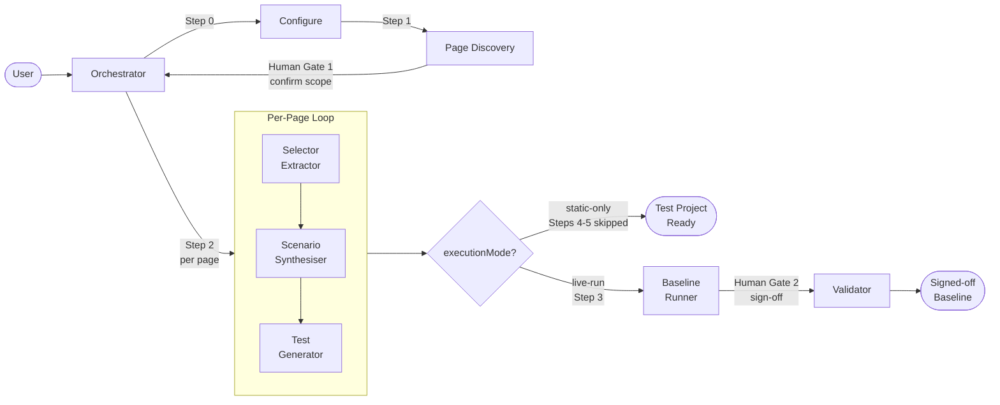

# E2E Behavioural Baseline Agent Framework
 
A GitHub Copilot Agent Mode pipeline that generates a self-contained C# Playwright
test suite from a pre-migration ASP.NET Web Forms codebase. The suite acts as a
signed-off behavioural baseline that proves post-migration functional equivalence.
 
---
 
## Why This Exists
 
Migrating from Web Forms to ASP.NET Core Razor Pages means every page is rebuilt
from scratch. The only reliable way to prove the new application behaves identically
to the old one is a test suite written **before** migration begins, run against the
old app to establish a known-good baseline, then re-run against the new app.
 
The challenge is that Web Forms and Razor Pages produce completely different HTML —
every element ID, URL, and form structure changes. A test suite written against Web
Forms DOM will fail entirely against Razor Pages even when the behaviour is identical.
 
**The solution** is to write tests against *user-observable semantics* — what labels
say, what buttons are called, what messages appear — not against DOM structure.
These semantics are expressed in a **selector registry** (JSON, one file per page)
that is the only thing that needs updating when the UI rebuilds. The test scenarios
and assertions remain untouched.
 
---
 
## Design Decisions
 
| Decision | Rationale |
|---|---|
| **C# output, regardless of source language** | Team is .NET; no TypeScript context switch; route/model constants can be shared |
| **Selector registry as separate JSON** | Single point of change post-migration; machine-readable; diffable in PRs |
| **Static analysis first; live browser validation optional** | Discovers all pages without a running app; live run (controlled via `executionMode` in config) catches rendering differences when a deployment is available |
| **Full asset analysis per page** | `.aspx`, `.vb/.cs`, `.js`, `.ascx`, master page — JavaScript behaviour is part of the spec |
| **Telerik controls flagged, not excluded** | Tests run pre-migration with Telerik patterns; method bodies (not specs) are replaced post-migration |
| **Orchestrator + sub-agents pattern** | Mirrors existing `pdf-migration-orchestrator` infrastructure; each agent has a narrow, guardrailed responsibility |
| **Dual-mode orchestrator** | Works standalone (interactive) and as a sub-agent (reads config argument) — no behaviour difference |
| **Self-contained generated project** | Zero `<ProjectReference>` elements; runs from any checkout without loading the source solution |
| **`e2e-baseline-` prefix on all agents** | Groups agents visually in the `/Agents/` directory; avoids collision with other agent sets |
 
---
 
## Process Flow
 

 
---
 
## Framework Objects
 
### Agents (`.github/Agents/`)
 
All agents are prefixed `e2e-baseline-` so they group together in the Agents directory.
 
| Agent | Mode | Tools | Responsibility |
|---|---|---|---|
| `e2e-baseline-orchestrator` | user-invocable + sub-agent | `agent, read, search, todos, thinking, edit` | Drives pipeline; enforces gates; surfaces human decisions |
| `e2e-baseline-page-discovery` | sub-agent only | `read, search, todos` | Scans all `.aspx` files; writes page inventory. **Read-only.** |
| `e2e-baseline-selector-extractor` | sub-agent only (per page) | `read, search, edit, todos` | Classifies every UI element into a typed selector descriptor |
| `e2e-baseline-scenario-synthesiser` | sub-agent only (per page) | `read, search, edit, todos, thinking` | Reads all page assets; derives test scenarios from evidence |
| `e2e-baseline-test-generator` | sub-agent only (per page) | `read, edit, search, todos` | Generates C# selector class, page object, and test spec |
| `e2e-baseline-runner` | sub-agent only | `read, edit, execute, todos` | Runs `dotnet test`; categorises failures |
| `e2e-baseline-validator` | sub-agent only | `read, edit, todos` | Proposes corrections; writes sign-off report |
 
### Skill (`.github/Skills/e2e-baseline/`)
 
| File | Loaded by | Content |
|---|---|---|
| `SKILL.md` | Orchestrator | Index, pipeline overview, artefact schemas |
| `references/discovery-procedure.md` | `page-discovery` | `.aspx` scanning rules, complexity classification |
| `references/selector-extraction-rules.md` | `selector-extractor` | Selector priority order, Telerik ID patterns, edge cases |
| `references/asset-analysis-procedure.md` | `scenario-synthesiser` | 10-step file resolution order; what to extract per file type |
| `references/scenario-synthesis-rules.md` | `scenario-synthesiser` | Per-category rules; naming; evidence requirements |
| `references/test-generation-patterns.md` | `test-generator` | Exact C# patterns for every generated file type |
| `references/baseline-validation-guide.md` | `validator` | Failure classification tree; correction and sign-off procedure |
 
Reference docs are loaded progressively — each agent loads only its own doc,
keeping per-invocation context lean.
 
### Asset Templates (`.github/skills/e2e-baseline/assets/`)
 
| Template | Generates |
|---|---|
| `e2e-baseline.config.json.template` | Pipeline configuration file |
| `page-inventory.json.template` | Page discovery artefact schema |
| `asset-manifest.json.template` | Per-page file analysis artefact schema |
| `selectors-registry.json.template` | Per-page selector registry schema |
| `E2EProject.csproj.template` | C# test project (NuGet only, no project refs) |
| `GlobalUsings.cs.template` | Global C# using directives |
| `Routes.cs.template` | URL constants (pre-migration `.aspx` paths) |
| `TestSettings.cs.template` | Reads `E2E_BASE_URL` environment variable |
| `BasePageTest.cs.template` | NUnit base class extending `PageTest` |
| `TelerikHelper.cs.template` | Telerik control interaction wrappers |
| `SemanticLocatorExtensions.cs.template` | Selector type → `ILocator` conversion |
| `PageSelectors.cs.template` | Per-page static selector class |
| `PageObject.cs.template` | Per-page Playwright page object |
| `PageSpec.cs.template` | Per-page NUnit test spec |
| `README.md.template` | Generated project README with post-migration guide |
 
### Artefacts (`docs/e2e-baseline/`)
 
JSON files form the state bus between agents. The orchestrator reads each
file's `"status"` field as a hard gate before proceeding.
 
| Artefact | Written by | Read by |
|---|---|---|
| `e2e-baseline.config.json` | Orchestrator (interactive) or pre-existing | All agents |
| `page-inventory.json` | `page-discovery` | `selector-extractor`, `scenario-synthesiser` |
| `asset-manifests/{Page}.assets.json` | `scenario-synthesiser` | `validator` |
| `selector-registry/{Page}.selectors.json` | `selector-extractor` | `test-generator`, `validator` |
| `scenario-catalogue/{Page}.scenarios.json` | `scenario-synthesiser` | `test-generator` |
| `baseline-results.json` | `runner` | `validator`, orchestrator |
| `baseline-report.md` | `validator` | Human reviewer |
 
### Generated Test Project (`{{OutputProjectName}}/`)
 
```
{{OutputProjectName}}.csproj          NuGet only — zero project references
GlobalUsings.cs
Config/
  Routes.cs                           URL constants — update post-migration
  TestSettings.cs                     Reads E2E_BASE_URL — no hard-coded URLs
Infrastructure/
  BasePageTest.cs                     NUnit base class
  TelerikHelper.cs                    Pre-migration Telerik wrappers
  SemanticLocatorExtensions.cs        Selector type → ILocator factory
Selectors/
  {PageName}Selectors.cs              Static class — one per page
Pages/
  {PageName}Page.cs                   Page object — one per page
Specs/
  {PageName}Tests.cs                  NUnit test spec — one per page
README.md
```
 
All generated code is **C#** regardless of whether the source project is VB.NET.
 
---
 
## Human Gates
 
Only two points require human input — everything else is automated:
 
| Gate | When | What is asked |
|---|---|---|
| **Gate 1 — Scope** | After page discovery | Which pages to include/exclude from the baseline |
| **Gate 2 — Sign-off** | After the baseline test run | Approve the results as the agreed pre-migration baseline |
 
---
 
## Usage
 
### Standalone (interactive)
 
In GitHub Copilot Agent Mode:
 
```
@e2e-baseline-orchestrator
```
 
The orchestrator asks four questions:
1. Base URL of the running application
2. Relative path to the folder containing `.aspx` files
3. Namespace for the generated C# project
4. Output folder name for the generated project
 
### As a sub-agent (config provided)
 
A parent orchestrator passes the config path as an argument. The `e2e-baseline-orchestrator`
skips interactive setup and reads the existing config file, then runs the full
pipeline identically. Output is unchanged.
 
### Prerequisites
 
**Static-only mode** (`executionMode: "static-only"`) — no runtime prerequisites.
The pipeline generates the complete test project from static code analysis alone.
 
**Live-run mode** (`executionMode: "live-run"`) — additionally requires:
- The pre-migration application running and accessible at the configured `baseUrl`
- .NET SDK installed (for `dotnet test`)
- PowerShell available (for Playwright browser installation)
 
---
 
## Scenario Categories
 
The `e2e-baseline-scenario-synthesiser` analyses all associated files per page and
generates scenarios covering:
 
| Category | Evidence source |
|---|---|
| Happy path | Code-behind success redirect / success message |
| Required field validation | `RequiredFieldValidator` controls |
| Format validation | `RegularExpressionValidator` controls |
| Client confirm dialog | `OnClientClick` with `confirmPrompt` or similar |
| Navigation guard | `SavePrompt.ascx` user control present |
| UpdatePanel partial render | `hasUpdatePanel` + triggering action |
| TinyMCE rich-text field | Page JS or `RegisterStartupScript` referencing TinyMCE |
| Permission-gated content | `User.IsInRole(...)` in code-behind |
| Empty state | Null/empty collection check in code-behind |
| Redirect outcome | `Response.Redirect(...)` in event handler |
| AjaxControlToolkit modal | `ModalPopupExtender` + `$find(...)` in JS |
 
---
 
## Post-Migration Usage
 
When the migrated Razor Pages application is ready:
 
1. Set `E2E_BASE_URL` to the new application URL
2. **If label text changed**: update the value in
   `docs/e2e-baseline/selector-registry/{PageName}.selectors.json`,
   re-invoke `@e2e-baseline-test-generator {PageName}` to regenerate
   `Selectors/{PageName}Selectors.cs` — specs unchanged
3. **For replaced Telerik controls**: update the method body in
   `Pages/{PageName}Page.cs` to use semantic Playwright locators —
   specs unchanged
4. Run `dotnet test`
 
**All green = functional equivalence proven.**
 
`Specs/{PageName}Tests.cs` files are never modified post-migration unless a
business requirement genuinely changed. A failing spec after migration means a
real behavioural difference, not a selector problem.
 
---
 
## Guardrails Summary
 
| Agent | Key restriction |
|---|---|
| `page-discovery` | Read-only — no file edits |
| `selector-extractor` | Never invent selectors; never mark generated IDs as semantic |
| `scenario-synthesiser` | Every scenario must cite a file as evidence; no implementation detail in steps |
| `test-generator` | No inline selectors in specs; no VB output ever; no project references in `.csproj` |
| `runner` | Never modify test files; never retry more than once |
| `validator` | Never change scenario intent to make a test pass; sign-off requires explicit orchestrator signal |
 
---
 
## Change Log
 
### v1.1 — 2026-07-20 — DEFRA Standards Compliance Update
 
All changes were reviewed against the [DEFRA AI Config Examples](https://github.com/defra/defra-ai-config-examples),
[DEFRA Software Development Standards](https://defra.github.io/software-development-standards/),
and the [DEFRA AI Toolkit](https://digital.defra.gov.uk/ai-toolkit). No pipeline
behaviour, generated output, or artefact schemas were altered beyond what is
documented below.
 
| # | Change | File(s) | Description | Purpose | DEFRA Reference |
|---|--------|---------|-------------|---------|----------------|
| 1 | Remove `edit` from page-discovery tool list | `e2e-baseline-page-discovery.agent.md` | Removed `edit` from the `tools` frontmatter field. The agent declares itself read-only but previously listed `edit`, creating a contradiction. | Enforces the principle of least privilege — a read-only agent must not hold write capability. | [DEFRA Agents guide](https://github.com/DEFRA/defra-ai-config-examples/blob/main/pages/agents/index.md): *"For read-only review agents, omit `edit` and `execute` to enforce the principle of least privilege"* |
| 2 | Fix `todo` → `todos` in orchestrator tool list | `e2e-baseline-orchestrator.agent.md` | Corrected the misspelled tool name `todo` to `todos` in the frontmatter `tools` array. | `todo` is not a valid VS Code agent tool name; the incorrect form causes the progress-checklist feature to silently fail. | [DEFRA Agents guide](https://github.com/DEFRA/defra-ai-config-examples/blob/main/pages/agents/index.md): *"Add `todos` for any multi-step agent"* |
| 3 | Validate `outputProjectName` before shell commands | `e2e-baseline-runner.agent.md` | Added an explicit validation step in Step 1 requiring `outputProjectName` to match `^[A-Za-z0-9._-]+$` before it is interpolated into shell commands. | Prevents command injection via a crafted config value containing shell metacharacters. | [DEFRA AI Toolkit — Security](https://digital.defra.gov.uk/ai-toolkit/guidance/security): *"Review generated code against the OWASP Top 10"*; OWASP A03 Injection |
| 4 | Add `todos` tool to all 6 sub-agents | All sub-agent `.agent.md` files | Added `todos` to the `tools` frontmatter array for all six sub-agents. | Every sub-agent has a numbered multi-step procedure; `todos` provides visible progress tracking and surfaces which step is active. | [DEFRA Agents guide](https://github.com/DEFRA/defra-ai-config-examples/blob/main/pages/agents/index.md): *"Add `todos` for any multi-step agent"* |
| 5 | Fix `.github/Skills/` → `.github/skills/` path casing | All agent and SKILL.md files | Corrected all internal references from `.github/Skills/e2e-baseline/...` to `.github/skills/e2e-baseline/...` to match the actual directory name on disk. | On Linux-based CI runners and case-sensitive file systems, the incorrect capitalisation causes path resolution to fail silently. | [DEFRA SDS — Version control standards](https://defra.github.io/software-development-standards/standards/version_control_standards/) |
| 6 | Shorten all agent descriptions to ≤10 0 characters | All 7 `.agent.md` files | Replaced multi-sentence YAML block descriptions with single-sentence strings under 100 characters each. | The `description` field appears in the VS Code agent picker; long values are truncated. Concise descriptions also improve sub-agent auto-routing accuracy. | [DEFRA Agents guide](https://github.com/DEFRA/defra-ai-config-examples/blob/main/pages/agents/index.md): *"Keep the description under 100 characters"* |
| 7 | Add `## Role`, `## Rules`, `## References` to all sub-agents | All 6 sub-agent `.agent.md` files | Added `## Role` (expertise statement), renamed `## Guardrails` to `## Rules`, and added `## References` (normative links) to every sub-agent. | DEFRA's prescribed agent structure requires these three sections. `## Rules` is critical for encoding "never do" constraints that prevent unintended behaviour. | [DEFRA Agents guide](https://github.com/DEFRA/defra-ai-config-examples/blob/main/pages/agents/index.md): required structure: *Role, Workflow, Rules, References* |
| 8 | Add `thinking` tool to orchestrator and scenario-synthesiser | `e2e-baseline-orchestrator.agent.md`, `e2e-baseline-scenario-synthesiser.agent.md` | Added `thinking` to the `tools` array for the two agents that perform complex multi-step reasoning or coordinate many sub-agents. | `thinking` improves reasoning accuracy for complex analysis and coordination tasks, reducing hallucination risk on large-context invocations. | [DEFRA AI Config Examples — Orchestrator agent](https://github.com/DEFRA/defra-ai-config-examples/blob/main/pages/agents/orchestrator.md): `tools: [..., thinking]` |
| 9 | Add 30-page batch guard to orchestrator Step 3 | `e2e-baseline-orchestrator.agent.md` | Added an execution guard note in Step 3 instructing the orchestrator to pause after 30 pages and confirm with the user before continuing. | Prevents runaway token spend and unbounded execution on large legacy applications with many pages. | [DEFRA AI Toolkit — Agent swarms pattern](https://digital.defra.gov.uk/ai-toolkit/patterns/agent-swarms): *"Tool call limits prevented runaway execution"* |
| 10 | Add human review gate before runner execution (Step 4) | `e2e-baseline-orchestrator.agent.md` | Added a pre-run summary and confirmation prompt in Step 4 requiring the user to type "run" before the runner agent executes `dotnet test`. | DEFRA security guidance requires a human approval step before any agent triggers a command. AI-generated code runs only after the human has reviewed the project summary. | [DEFRA AI Toolkit — Security](https://digital.defra.gov.uk/ai-toolkit/guidance/security): *"Keep a human approval step before anything…runs a command"* |
| 11 | Add `license` and `metadata` to SKILL.md frontmatter | `.github/skills/e2e-baseline/SKILL.md` | Added `license: OGL-UK-3.0` and `metadata: { author: defra-digital, version: "1.1" }` to the SKILL.md frontmatter. | Provides version traceability and Open Government Licence attribution required for all Defra open-source artefacts. | [DEFRA AI Config Examples — Defra Standards Skill](https://github.com/DEFRA/defra-ai-config-examples/blob/main/pages/skills/defra-standards.md): `license: OGL-UK-3.0` and `metadata` fields |
| 12 | Add `.copilotignore` security check to orchestrator Step 0 | `e2e-baseline-orchestrator.agent.md` | Added a blockquote warning in Step 0 prompting the user to verify that `web.config`, `connectionStrings.config`, and other credential files are excluded from AI context via `.copilotignore`. | Legacy ASP.NET codebases commonly embed credentials in config files that sit alongside the code-behind files this pipeline reads. | [DEFRA AI Toolkit — Security](https://digital.defra.gov.uk/ai-toolkit/guidance/security): *"Stop AI coding tools reading secrets. Add an ignore file so the assistant skips anything sensitive"* |
| 13 | Standardise `generatedBy` and `generatedAt` in artefact schemas | `.github/skills/e2e-baseline/SKILL.md` | Added `generatedBy` and `generatedAt` fields to the selector-registry, asset-manifest, and scenario-catalogue JSON schemas. | Provides a complete audit trail of which agent produced each artefact and when — essential for diagnosing incorrect outputs in multi-agent pipelines. | [DEFRA AI Toolkit — Working with agents](https://digital.defra.gov.uk/ai-toolkit/guidance/working-with-agents): *"Use [logs and traces] to find where it went wrong"* |
| 14 | Add `## Evaluation Criteria` section to SKILL.md | `.github/skills/e2e-baseline/SKILL.md` | Added a table defining minimum quality checks for each artefact type (page-inventory, selector-registry, scenario-catalogue, spec files, baseline-results). | Provides structured evaluation criteria so teams can detect when a pipeline change degraded output quality before it propagates to the next stage. | [DEFRA AI Toolkit — Working with agents](https://digital.defra.gov.uk/ai-toolkit/guidance/working-with-agents): *"Evaluations let you see whether a change improved the agent or quietly broke something else"* |
| 15 | Add token-budget guidance to scenario-synthesiser Phase A | `e2e-baseline-scenario-synthesiser.agent.md` | Added a guidance blockquote in Phase A instructing the agent to process files in priority order (markup → code-behind → user controls → JS → business classes) and to add lower-priority files only when needed. | Prevents excessive token use on large pages with many associated files while preserving scenario completeness. | [DEFRA AI Toolkit — Sustainability](https://digital.defra.gov.uk/ai-toolkit/guidance/sustainability); [Token optimisation pattern](https://digital.defra.gov.uk/ai-toolkit/patterns/token-optimisation) |
| 16 | Rename `## Guardrails` → `## Rules` across all agents | All 7 `.agent.md` files | Renamed the section heading `## Guardrails` to `## Rules` in every agent file. | Aligns with DEFRA's standard agent structure which names this section `## Rules`. Consistent headings make agents easier to review and compare. | [DEFRA Agents guide](https://github.com/DEFRA/defra-ai-config-examples/blob/main/pages/agents/index.md): required structure includes `## Rules` |
| 17 | Document non-standard frontmatter fields | All 7 `.agent.md` files | Added a YAML comment `# user-invocable and agents are documentation-only metadata — not processed by VS Code` above `user-invocable` in each frontmatter block. | Clarifies that `user-invocable` and `agents:` are not part of the VS Code `.agent.md` schema and have no runtime effect, preventing confusion for developers unfamiliar with the project. | [DEFRA Agents guide](https://github.com/DEFRA/defra-ai-config-examples/blob/main/pages/agents/index.md): *"Standard frontmatter is `description` + `tools`. VS Code silently ignores unknown fields"* |
| 18 | Update README agent table and path references | `readme-e2e-baseline-agent-framework.md` | Updated the agents table to reflect the new tool lists from Changes 1–8, and corrected `.github/Skills/` to `.github/skills/` in the asset templates heading. | Keeps the README accurate as the authoritative reference for the framework. | Internal documentation standard |