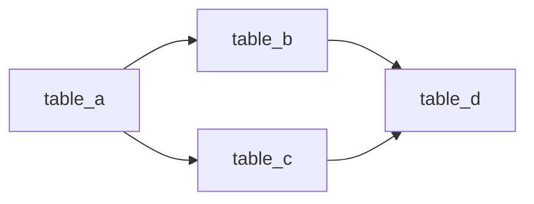
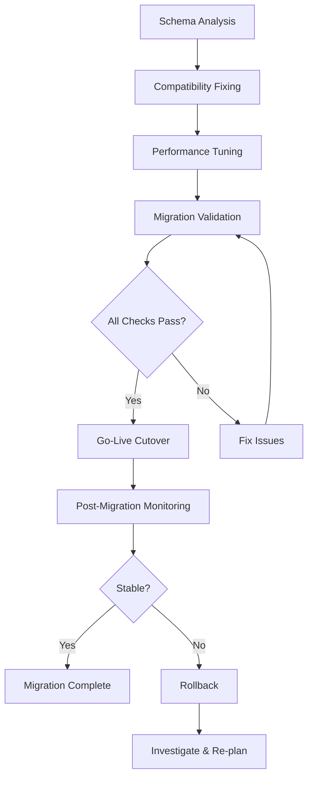

# Migration Report — [Project Name]

> **Source**: [Source Database Platform] [Version]
> **Target**: [Target Database Platform] [Version]
> **Date**: [Report Date]
> **Prepared by**: Database Migration Agent
> **Status**: [Draft / Final]

---

## 1. Executive Summary

[Summarise the migration in 3–5 paragraphs. Cover: source and target platforms,
total objects migrated, complexity rating, key risks and mitigations, validation
outcome.]

**Migration Scope**:

| Metric                | Value                             |
| --------------------- | --------------------------------- |
| Source Platform       | [e.g., Oracle 19c]                |
| Target Platform       | [e.g., PostgreSQL 16]             |
| Total Tables          | [count]                           |
| Total Views           | [count]                           |
| Stored Procedures     | [count]                           |
| Functions             | [count]                           |
| Triggers              | [count]                           |
| Indexes               | [count]                           |
| Total Row Count       | [count]                           |
| Estimated Data Volume | [e.g., 450 GB]                    |
| Complexity Rating     | [Low / Medium / High / Very High] |

---

## 2. Assessment Findings

> Source: **schema-analysis** phase

### 2.1 Object Inventory

| Object Type        | Count | Notes |
| ------------------ | ----- | ----- |
| Tables             |       |       |
| Views              |       |       |
| Materialised Views |       |       |
| Stored Procedures  |       |       |
| Functions          |       |       |
| Triggers           |       |       |
| Sequences          |       |       |
| Indexes            |       |       |
| Foreign Keys       |       |       |
| Check Constraints  |       |       |
| User-Defined Types |       |       |
| Synonyms           |       |       |
| DB Links           |       |       |

### 2.2 Foreign Key Dependency Graph



### 2.3 External Integrations

| Integration          | Type               | Impact on Migration                 |
| -------------------- | ------------------ | ----------------------------------- |
| [e.g., ETL Pipeline] | [Inbound/Outbound] | [Connection string update required] |

### 2.4 Migration Risks Identified

| Risk ID | Description | Severity | Mitigation |
| ------- | ----------- | -------- | ---------- |
| R-001   |             |          |            |

---

## 3. Data Model Decisions

> Not applicable — same-engine migration (SQL Server 2022 → Azure SQL Database / Amazon RDS SQL Server).
> No paradigm shift or data model redesign is required. The relational schema transfers directly.

---

## 4. Conversion Log

> Not applicable — same-engine migration (SQL Server 2022 → Azure SQL Database / Amazon RDS SQL Server).
> T-SQL DDL and stored procedures transfer directly with no type conversion or procedural rewriting required.
> Unsupported cloud features are tracked in Section 5 (Compatibility Fixes Applied).

---

## 5. Compatibility Fixes Applied

> Source: **compatibility-fixing** phase

### 5.1 Summary

| Category             | Auto-Fixed | Manual Review | Informational |
| -------------------- | ---------- | ------------- | ------------- |
| Dialect Quirks       |            |               |               |
| Reserved Words       |            |               |               |
| Collation            |            |               |               |
| Data Type Edge Cases |            |               |               |
| **Total**            |            |               |               |

### 5.2 Detailed Fixes

| Fix # | File/Object        | Pattern Found         | Fix Applied             | Quirks Reference   |
| ----- | ------------------ | --------------------- | ----------------------- | ------------------ |
| 1     | [e.g., schema.sql] | [e.g., Windows Auth]  | [e.g., Managed Identity] | [sqlserver-quirks #1] |

---

## 6. Performance Recommendations

> Source: **performance-tuning** phase

### 6.1 Critical Issues (Must Fix Before Go-Live)

| #   | Issue | Affected Object | Recommendation | Impact | Effort |
| --- | ----- | --------------- | -------------- | ------ | ------ |
|     |       |                 |                |        |        |

### 6.2 Performance Improvements (Recommended)

| #   | Issue | Affected Object | Recommendation | Impact | Effort |
| --- | ----- | --------------- | -------------- | ------ | ------ |
|     |       |                 |                |        |        |

### 6.3 Monitoring Setup

| Metric                      | Tool / Query                                                   | Threshold             |
| --------------------------- | -------------------------------------------------------------- | --------------------- |
| Slow queries                | Query Store / `sys.query_store_runtime_stats`                  | avg_elapsed_time > 1s |
| CPU utilisation             | Azure Monitor / CloudWatch `CPUPercent`                        | > 80%                 |
| DTU / vCore usage           | Azure Portal Metrics / Performance Insights                    | > 80%                 |
| Connection count            | `sys.dm_exec_sessions` / CloudWatch `DatabaseConnections`      | Per-SKU limit         |
| Missing index opportunities | `sys.dm_db_missing_index_details`                              | improvement_measure > 1000 |

### 6.4 Configuration Baseline

| Parameter        | Recommended Value | Rationale                              |
| ---------------- | ----------------- | -------------------------------------- |
| [e.g., work_mem] | [e.g., 256MB]     | [Sort operations on large result sets] |

---

## 7. Validation Results

> Source: **migration-validation** phase

### 7.1 Summary

| Check Category     | Total | Passed | Failed | Skipped |
| ------------------ | ----- | ------ | ------ | ------- |
| Row Counts         |       |        |        |         |
| Schema Structure   |       |        |        |         |
| Constraints        |       |        |        |         |
| Indexes            |       |        |        |         |
| Sequences          |       |        |        |         |
| Functional (Procs) |       |        |        |         |
| **Total**          |       |        |        |         |

### 7.2 Row Count Comparison

| Table Name       | Source Count | Target Count | Match | Notes |
| ---------------- | ------------ | ------------ | ----- | ----- |
| [e.g., orders]   | [1,234,567]  | [1,234,567]  | ✅    |       |
| [e.g., products] | [45,678]     | [45,678]     | ✅    |       |

### 7.3 Failed Checks

| Check ID | Category | Object | Expected | Actual | Remediation |
| -------- | -------- | ------ | -------- | ------ | ----------- |
|          |          |        |          |        |             |

---

## 8. Migration Runbook

### 8.1 Pre-Migration Checklist

- [ ] Source database backup completed and verified
- [ ] Maintenance window scheduled and communicated
- [ ] Stakeholders notified of planned downtime
- [ ] Rollback plan reviewed and approved
- [ ] Target environment provisioned and connectivity tested
- [ ] Application connection strings prepared (not yet switched)
- [ ] Monitoring and alerting configured on target

### 8.2 Backup Commands

```bash
# SQL Server 2022 source — full compressed backup
BACKUP DATABASE [DatabaseName]
TO DISK = 'D:\Backups\DatabaseName_premigration.bak'
WITH COMPRESSION, CHECKSUM, STATS = 10;

# Verify the backup before migration:
RESTORE VERIFYONLY
FROM DISK = 'D:\Backups\DatabaseName_premigration.bak';

# Export as BACPAC (schema + data; suitable for Azure SQL Database import):
# Requires SqlPackage.exe (ships with SSMS or available standalone)
SqlPackage /Action:Export `
    /SourceServerName:<source-server> `
    /SourceDatabaseName:<database> `
    /TargetFile:DatabaseName_$(Get-Date -f yyyyMMdd).bacpac `
    /SourceUser:<user> /SourcePassword:<password>
```

### 8.3 Schema Deployment Order

Deploy in this order to respect foreign key dependencies:

1. Extensions / prerequisites (`CREATE EXTENSION`, custom types)
2. Sequences
3. Tables (columns and data types only, no constraints)
4. Primary keys
5. Data migration (see 8.4)
6. Unique constraints
7. Foreign keys
8. Check constraints
9. Indexes
10. Views
11. Functions
12. Stored procedures
13. Triggers
14. Grants / permissions

### 8.4 Data Migration Commands

```bash
# Option A: Import BACPAC into Azure SQL Database (schema + data):
SqlPackage /Action:Import `
    /TargetServerName:<azure-sql-server>.database.windows.net `
    /TargetDatabaseName:<database> `
    /SourceFile:DatabaseName.bacpac `
    /TargetUser:<user> /TargetPassword:<password>

# Option B: Native backup/restore to Azure SQL Managed Instance or RDS SQL Server:
# 1. Copy .bak to Azure Blob Storage or Amazon S3
# 2. Restore from URL (Azure SQL MI):
RESTORE DATABASE [DatabaseName]
FROM URL = 'https://<storage>.blob.core.windows.net/<container>/DatabaseName.bak'
WITH MOVE 'DatabaseName'     TO '/var/opt/mssql/data/DatabaseName.mdf',
     MOVE 'DatabaseName_log' TO '/var/opt/mssql/data/DatabaseName_log.ldf',
     STATS = 10;

# Option C: Azure Database Migration Service (online, CDC-based, minimal downtime):
# Configure via Azure Portal:
#   Source endpoint: SQL Server 2022 on-premises
#   Target endpoint: Azure SQL Database or RDS SQL Server
#   Mode: Online (< 4 h downtime) or Offline (full cutover)

# Option D: BCP bulk export/import for high-volume tables:
bcp [DatabaseName].[dbo].[TableName] out TableName.bcp -S <source> -T -n
bcp [DatabaseName].[dbo].[TableName] in  TableName.bcp -S <target> -T -n
```

### 8.5 Post-Migration Validation

1. Run the **migration-validation** skill against both databases
2. Verify all row counts match (or are within stated tolerance)
3. Run application smoke tests against the target database
4. Execute critical stored procedures with known inputs and compare outputs
5. Check sequence current values are safely ahead of max ID values
6. Verify grants and permissions are applied correctly

### 8.6 Rollback Procedure

If critical issues are found after migration:

1. **Stop** application traffic to the target database
2. **Do not** drop or modify the target database (preserve for investigation)
3. **Revert** application connection strings to the source database
4. **Restart** the application against the source database
5. **Verify** the source database is still serving correctly
6. **Investigate** the failure using target database logs and validation results
7. **Document** the issue in the Risk Register for re-attempt planning

### 8.7 Go-Live Cutover

1. Switch application connection strings to the target database
2. Update DNS records if applicable
3. Invalidate application caches
4. Monitor error rates and performance dashboards for 30 minutes
5. If stable, confirm go-live with stakeholders
6. Decommission source database access (read-only, then archive)

---

## 9. Estimated Downtime

| Scenario   | Duration   | Assumptions                                           |
| ---------- | ---------- | ----------------------------------------------------- |
| Best Case  | [e.g., 2h] | [Clean migration, no issues, high network throughput] |
| Expected   | [e.g., 4h] | [Minor fixes needed, standard network speed]          |
| Worst Case | [e.g., 8h] | [Rollback and retry needed, low throughput]           |

**Factors affecting downtime**:

- Data volume: [X] GB
- Migration method: [Online (DMS/CDC) / Offline (dump/restore)]
- Network throughput: [X] Mbps between source and target
- Index rebuild time on target: estimated [X] minutes

---

## 10. Risk Register

| Risk ID | Description                                                       | Likelihood | Impact | Mitigation                                 | Owner | Status |
| ------- | ----------------------------------------------------------------- | ---------- | ------ | ------------------------------------------ | ----- | ------ |
| R-001   | [e.g., Data type precision loss during NUMBER→NUMERIC conversion] | Medium     | High   | [Validate boundary values post-migration]  | [DBA] | Open   |
| R-002   | [e.g., Stored procedure logic behaves differently on target]      | Medium     | High   | [Functional validation with test datasets] | [Dev] | Open   |
| R-003   | [e.g., Application queries timeout on new indexes]                | Low        | Medium | [Performance tuning phase + monitoring]    | [DBA] | Open   |

---

## 11. Sign-off Checklist

| #   | Item                                     | Status    | Signed By | Date |
| --- | ---------------------------------------- | --------- | --------- | ---- |
| 1   | Schema validation passed                 | [ ] / [x] |           |      |
| 2   | Row count validation passed              | [ ] / [x] |           |      |
| 3   | Constraint validation passed             | [ ] / [x] |           |      |
| 4   | Functional validation passed             | [ ] / [x] |           |      |
| 5   | Application smoke tests passed on target | [ ] / [x] |           |      |
| 6   | Performance benchmarks met               | [ ] / [x] |           |      |
| 7   | Rollback procedure tested                | [ ] / [x] |           |      |
| 8   | Security review completed                | [ ] / [x] |           |      |
| 9   | Stakeholder sign-off received            | [ ] / [x] |           |      |

---

## Migration Flow



---

_Report generated by the Database Migration Agent. Review all sections before
proceeding with go-live._
